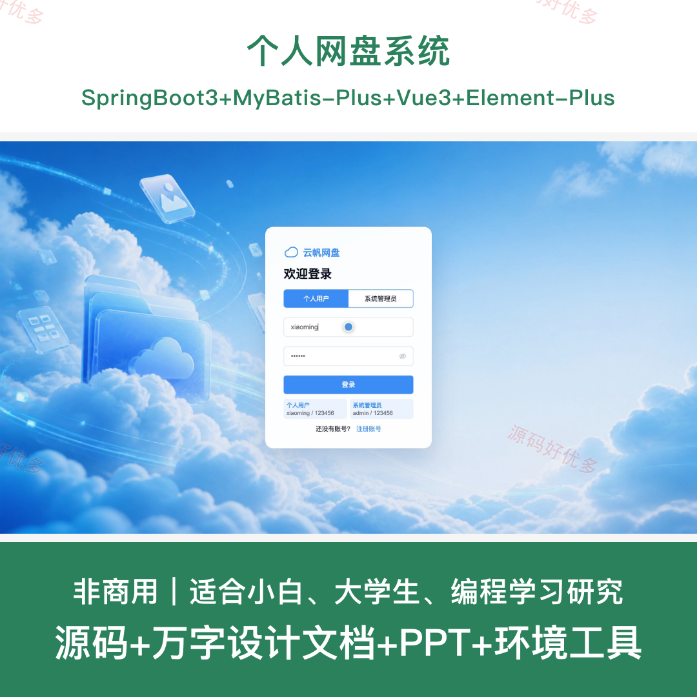
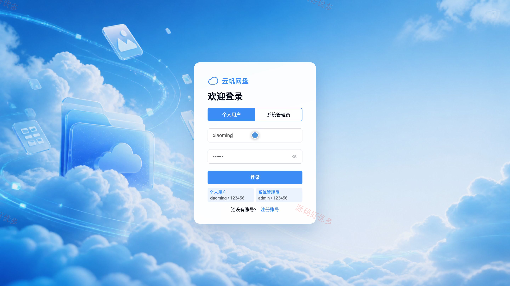
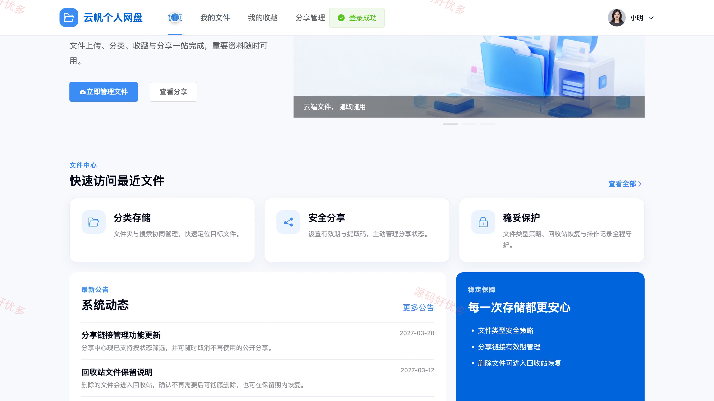
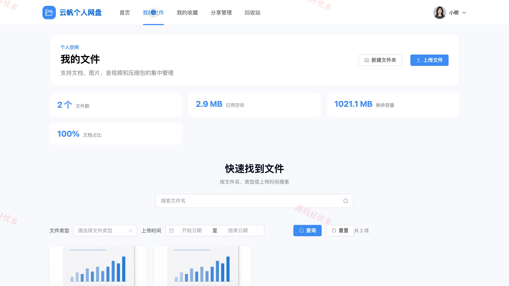
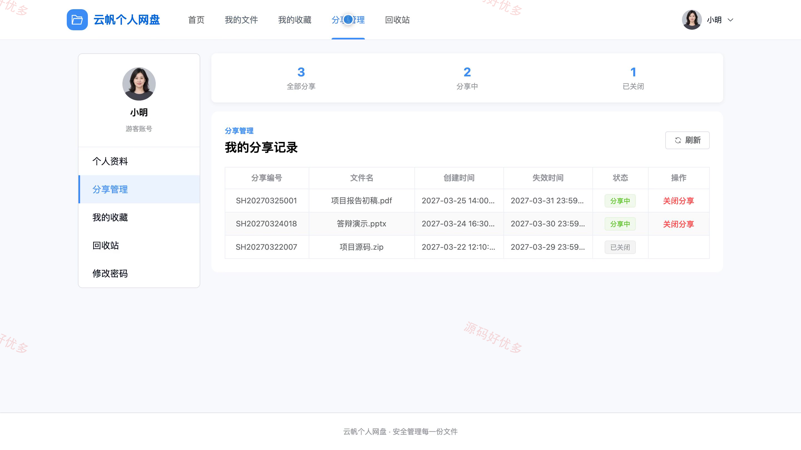
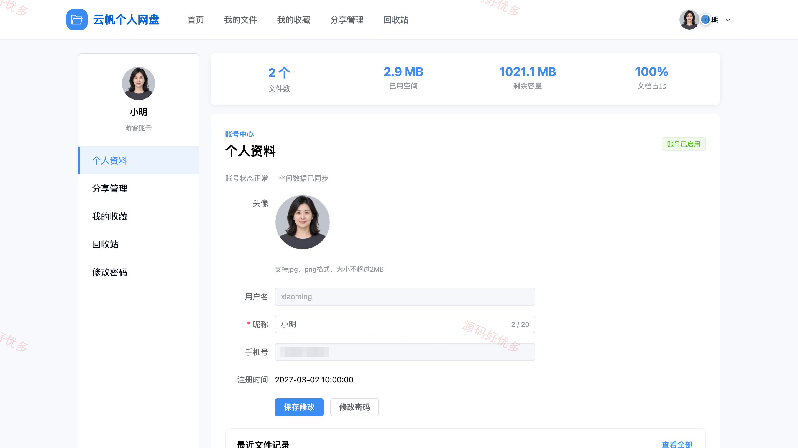
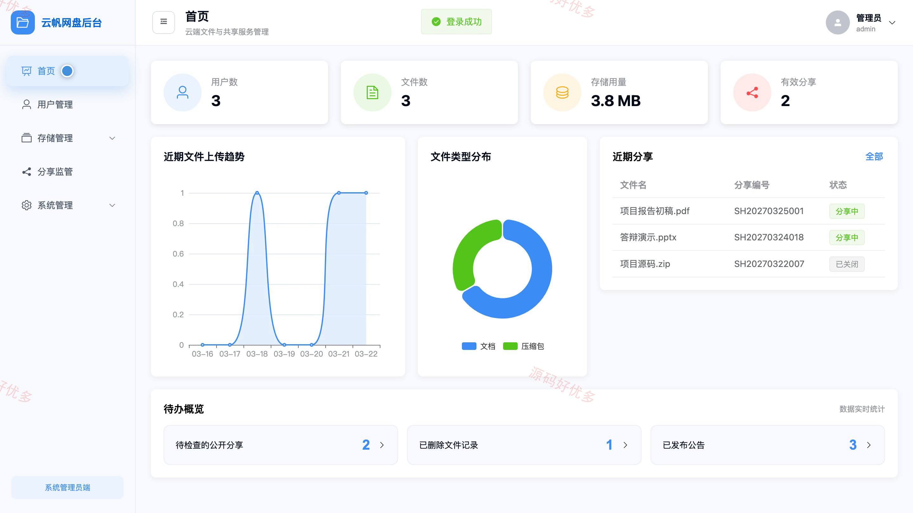
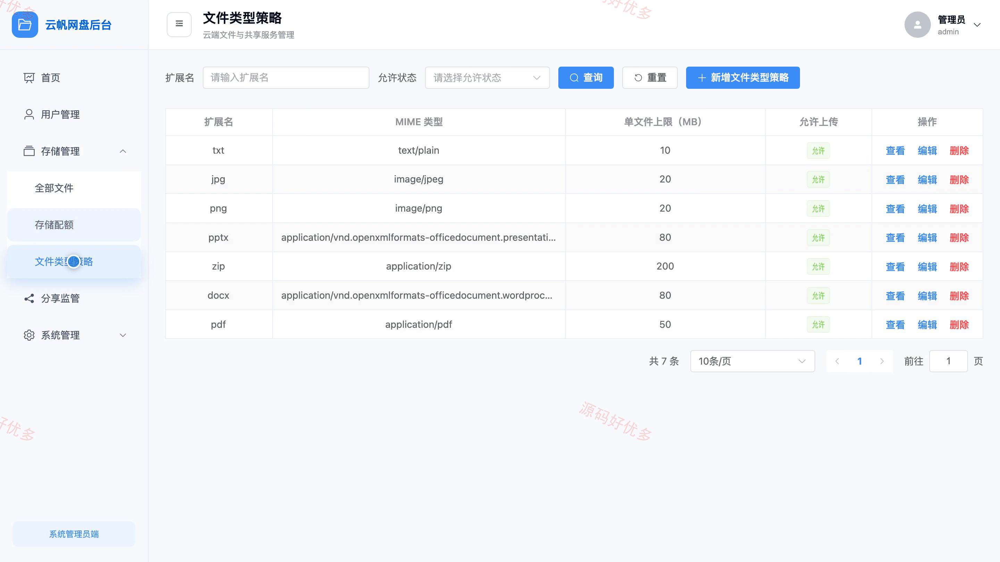
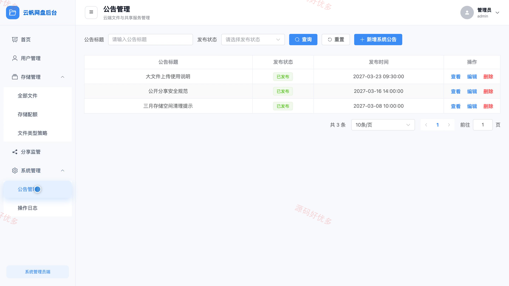

## 源码问题查看主页咨询

### 一、关键词
个人网盘、云存储、文件管理、网络硬盘、文件分享

### 二、作品包含
源码+数据库+万字设计文档+PPT+全套环境和工具资源+本地部署教程

### 三、项目技术
前端技术： Html、Css、Js、Vue3.4、Element-Plus
后端技术：Java、SpringBoot3.2.0、MyBatis-Plus

### 四、运行环境（以下版本亲测，其他版本兼容性请自行测试）
开发工具：IDEA/eclipse + VSCODE

数据库：MySQL5.7+（共14张表）

数据库管理工具：Navicat10以上版本

环境配置软件： JDK17 + Maven

前端Nodejs：16+

浏览器：谷歌浏览器

### 五、项目介绍
项目编号：bs071A

个人网盘系统面向管理员、用户，提供项目核心业务等功能，实现各角色在系统中的实际业务协作。

角色：用户、管理员

用户功能：注册登录、文件上传下载、文件与文件夹管理、在线预览、文件搜索筛选、文件收藏、分享链接管理、回收站管理。

管理员功能：用户管理、存储配额管理、文件类型策略、分享监管、公告管理、操作日志、数据统计。

### 六、运行截图

